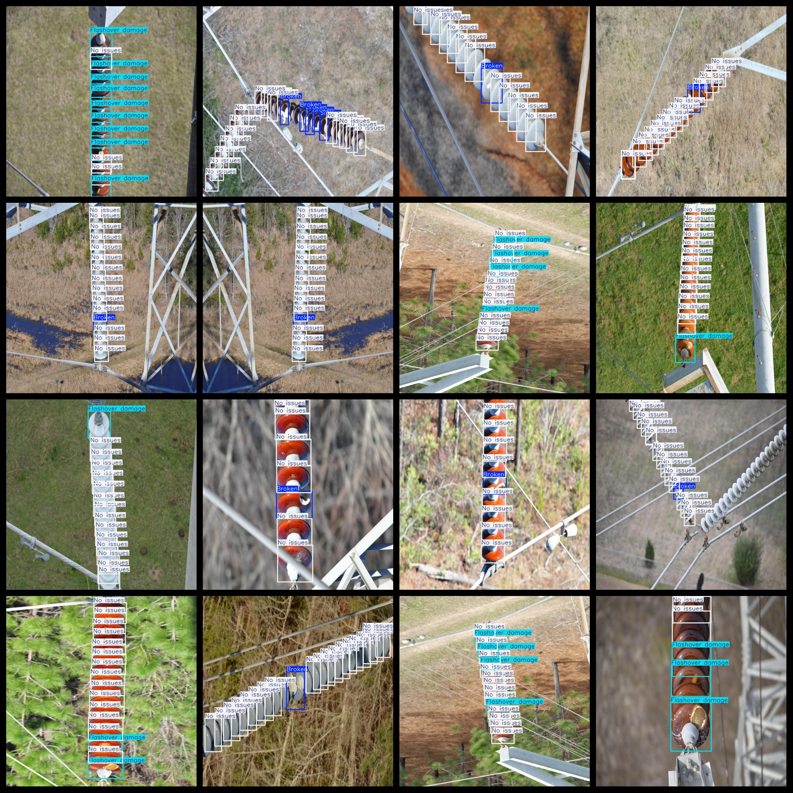

# UAV View Aerial Insulator Defect Detection Dataset

A drone-view aerial insulator defect detection dataset, consisting of 1595 images and 3-class labels organized in YOLO-VOC format.

The dataset is formatted as both VOC and YOLO formats. It includes three folders within the compressed package: JPEGImages, Annotations, and labels.

The JPEGImages folder contains a total of 1595 JPEG images.

The Annotations folder consists of 1595 XML files.

The labels folder contains a total of 1595 txt files.

There are a total of 3 types of labels: "Broken", "Flashover damage", and "No issues".

The Chinese translation for each label is as follows:

- Broken: damage
- Flashover damage: flashover damage
- No issues: No problems.

Each label has a corresponding number of boxes (notice that the order in the YOLO format categories does not match this, but is based on the classes.txt file in the labels folder).

- Broken: Boxes = 1176
- Flashover damage: Boxes = 2563
- No issues: Boxes = 13359

Total box count: 17098

The image resolution is clear with a high quality.

The images have been enhanced.

Labels are rectangular boxes used for target detection recognition.

Special Notes: There are no guarantees regarding the accuracy or weights of the trained models, only accurate and reasonable annotations provided.

Labeling and Image Details:
## Images

---

Here is a pay link on Stripe (https://buy.stripe.com/3cs8yP7sY87d0vu9AB). Please contact me lonlonago@foxmail.com after funding $89, and I will send you a complete data files, thank you!

